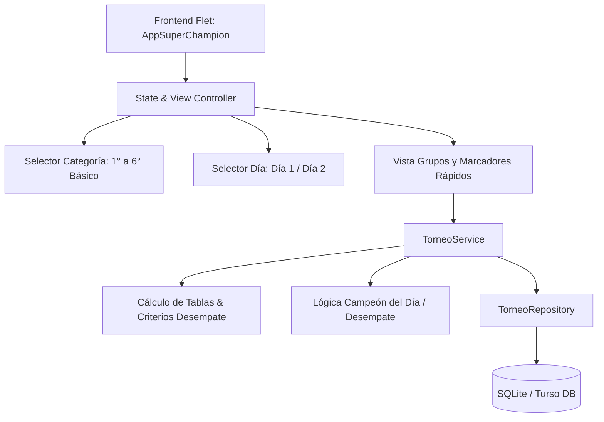

# Requirements

### Overview & Goals
El objetivo es crear una nueva aplicación independiente denominada **AppSuperChampion** optimizada específicamente para la gestión de campeonatos de fútbol escolar o formativo organizados por **Categorías** (desde 1° a 6° Básico o personalizables), **Días** (Día 1 / Día 2) y **Grupos** (Grupo A, Grupo B, etc.).

A diferencia de `AppPartidos`, esta aplicación elimina la gestión de planteles individuales, titulares, cambios y control de minutos por jugador, enfocándose al 100% en la **velocidad de registro de marcadores en vivo**, **cálculo automático de tablas de posiciones** y **definición de punteros/campeones del día**.

---

### Scope

#### In Scope
- **Jerarquía de Torneo**: Navegación por `Categoría ➔ Día ➔ Grupo ➔ Partidos`.
- **Modelo de 2 Roles de Acceso**:
  - **Modo Consulta (Público / Padres / Delegados)**: Acceso directo y libre sin contraseña; visualización de tablas en tiempo real, marcadores y campeón con casillas bloqueadas.
  - **Modo Organizador (Mesa de Control)**: Desbloqueo mediante PIN de seguridad (ej. 4 dígitos); permite crear/eliminar torneos, categorías, grupos, fixture y modificar/guardar marcadores en vivo.
- **Registro Rápido de Marcadores**: Ingreso directo de resultados (`Goles Local` vs `Goles Visita`) con guardado inmediato en SQLite/Turso para la mesa de control.
- **Tabla de Posiciones en Tiempo Real**: Cálculo automático de PJ, PG, PE, PP, GF, GC, DG y Puntos con criterios de desempate oficiales.
- **Definición de Campeón del Día**:
  - Puntero automático si no hay empate.
  - Detección de empate en primer lugar y generación de Partido Adicional de Desempate.
  - Definición de Final entre 1° Grupo A vs 1° Grupo B para el Día 2.
- **Persistencia Flexible**: Soporte para base de datos local SQLite y nube Turso (LibSQL).
- **Diseño Moderno y Responsivo**: Interfaz oscura con paleta Flet consistente y adaptada a tablets/móviles para mesas de control.

#### Out of Scope
- Gestión de planteles por jugador (nombres, dorsales, posiciones).
- Cronómetro en vivo segundo a segundo y alertas de tiempo.
- Control de sustituciones y minutos jugados individuales.
- Registro de tarjetas individuales por jugador.

---

### User Stories
- **Como Coordinador de Mesa / Cancha**, quiero seleccionar rápidamente la categoría y el día para registrar los marcadores de los partidos a medida que terminan sin tener que configurar planteles.
- **Como Delegado / Espectador**, quiero ver la tabla de posiciones actualizada al instante para saber quién lidera el grupo de mi categoría.
- **Como Organizador del Torneo**, quiero que el sistema me indique automáticamente si se definió un Campeón del Día o si es necesario disputar un partido de desempate.

# Technical Design

### Current Architecture vs New AppSuperChampion

```
AppPartidos (Actual)                        AppSuperChampion (Nueva)
---------------------                        ------------------------
- Complejidad alta                           - Alta velocidad y simpleza
- Planteles, titulares, suplentes            - Sin nóminas de jugadores
- Cronómetro en vivo y segundo a segundo     - Marcadores directos (Goles L vs Goles V)
- Roles DT Delegado / Árbitro / Minutos      - Mesa de control y consulta general
- 1 Cuadrangular por fecha                   - Múltiples Categorías (1° a 6° Básico) x Días
```

---

### Architecture Diagram



---

### Key Decisions
1. **Proyecto e Intérprete Separados**:
   - Se creará en `/Users/moises/PycharmProjects/AppSuperChampion` con su propio repositorio Git y entorno virtual independiente.
2. **Modelo de Seguridad y Roles (PIN para Mesa de Control)**:
   - Acceso libre por defecto en modo consulta (sin login para espectadores).
   - Modal de autenticación rápida con PIN para el rol Organizador/Mesa de Control.
   - En el backend, validación de permisos en `TorneoService` antes de persistir mutaciones o cambios de marcadores.
3. **Modelo de Datos Normalizado por Categoría y Día**:
   - Tabla `categorias`: `id`, `nombre` (ej: "1° Básico", "2° Básico").
   - Tabla `grupos`: `id`, `categoria_id`, `dia`, `nombre` (ej: "Grupo A", "Grupo B").
   - Tabla `partidos`: `id`, `grupo_id`, `equipo_local`, `equipo_visita`, `goles_local`, `goles_visita`, `jugado`, `es_definicion`.
4. **Persistencia Híbrida**:
   - Reutilización del conector `libsql_experimental` compatible tanto con base de datos local SQLite como con Turso Cloud.

---

### File Structure Propuesta

```
AppSuperChampion/
├── backend/
│   ├── database/
│   │   ├── connection.py
│   │   ├── schema.py
│   │   └── repositories.py
│   ├── models/
│   │   ├── categoria.py
���   │   ├── grupo.py
│   │   └── partido.py
│   └── services/
│       ├── torneo_service.py
│       └── tabla_service.py
├── config/
│   ├── constants.py
│   └── settings.py
├── frontend/
│   ├── components/
│   │   ├── header.py
│   │   ├── selector_categoria.py
│   │   ├── tabla_posiciones.py
│   │   ├── lista_partidos.py
│   │   └── tarjeta_campeon.py
│   └── views/
│       └── torneo_view.py
├── tests/
│   └── test_superchampion.py
├── .gitignore
├── Dockerfile
├── main.py
├── README.md
└── requirements.txt
```

# Testing

### Validation Approach
La validación se realizará mediante pruebas automatizadas sin interfaz gráfica combinadas con la verificación de sintaxis y compilación completa del proyecto.

---

### Key Scenarios
1. **Creación y Carga de Torneo por Categorías**:
   - Verificar la inicialización de las 6 categorías (1° a 6° básico) con sus respectivos grupos para Día 1 y Día 2.
2. **Cálculo de Tablas de Posiciones**:
   - Validar ordenamiento correcto por Puntos > Diferencia de Goles > Goles a Favor > Enfrentamiento Directo.
3. **Guardado Rápido de Marcadores**:
   - Confirmar que al guardar un resultado (`2 - 1`), los casilleros de PJ, PG, PP, GF, GC y Pts se recalculen inmediatamente.
4. **Determinación de Campeón y Desempate**:
   - Caso 1: Puntero único con mayor puntaje $\rightarrow$ Estado `CAMPEÓN`.
   - Caso 2: Empate en puntos y diferencia de goles $\rightarrow$ Generación de `PARTIDO DE DEFINICIÓN`.
   - Caso 3: Final Día 2 entre Ganador Grupo A vs Ganador Grupo B.

---

### Verification Commands
- `python -m unittest discover -v -s tests -t .`
- `python -m compileall main.py backend config frontend utils tests`

# Delivery Steps

### * Step 1: Consolidar y respaldar repositorio actual AppPartidos
Dejar el repositorio actual de `AppPartidos` completamente respaldado y sincronizado antes de cambiar de proyecto.

- Ejecutar la suite de pruebas unitarias/integrales `tests/test_integral.py` para asegurar que no hay regresiones.
- Realizar commit de todos los cambios pendientes en la rama `feature/proteccion-goles-concurrencia`.
- Integrar (`merge`) los cambios a la rama `main` y realizar `git push` a `origin/main` dejando el espacio de trabajo limpio.

###   Step 2: Inicializar proyecto base y entorno para AppSuperChampion
Inicializar el nuevo directorio de proyecto independiente `AppSuperChampion` con su configuración base.

- Crear el directorio del proyecto `/Users/moises/PycharmProjects/AppSuperChampion`.
- Inicializar repositorio Git local (`git init`).
- Crear entorno virtual Python (`python -m venv venv`) e instalar dependencias base (`flet`, `libsql-experimental`, `python-dotenv`).
- Configurar `.gitignore`, `requirements.txt`, `README.md` y archivos de configuración (`config/settings.py`, `config/constants.py`).

###   Step 3: Implementar Backend y Servicios de Torneo por Categorías
Crear la capa de datos, seguridad por PIN y lógica de negocio adaptada a torneos por categorías, días y grupos.

- Implementar `backend/database/connection.py` y `backend/database/schema.py` para SQLite/Turso con soporte nativo para `categoria` (1° a 6° básico), `dia` (Día 1 / Día 2) y `grupo` (Grupo A / Grupo B).
- Crear modelos de datos ligeros `Categoria`, `Grupo`, `Partido` y `TablaPosiciones`.
- Implementar `TorneoService` con métodos y control de permisos:
  - Validación de PIN de Organizador para mutaciones y configuración de torneo.
  - Cargar partidos y grupos por categoría y día para modo consulta.
  - Guardar marcadores rápidos (`guardar_marcador(partido_id, goles_local, goles_visita, es_organizador)`).
  - Calcular tablas de posiciones (PJ, PG, PE, PP, GF, GC, DG, Pts) y criterios de desempate.
  - Determinar puntero del grupo, finalistas y necesidad de partido adicional de definición.

###   Step 4: Implementar Interfaz Flet (Categorías, Grupos, Marcadores y Campeón)
Construir una interfaz de usuario ágil y reactiva con Flet con diferenciación de vistas para Consulta y Organizador (Mesa de Control).

- Crear `main.py` con el layout principal oscuro y reactivo.
- Diseñar el Header con indicador de rol y botón de desbloqueo `🔒 Acceso Organizador` (diálogo modal de PIN de 4 dígitos).
- Diseñar la barra superior de selección rápida:
  - Selector de Categoría (`1° Básico` a `6° Básico`).
  - Selector de Día (`Día 1` / `Día 2`).
- Crear la vista central con:
  - Selector de Grupos (Chips `Grupo A`, `Grupo B`, `Todos`).
  - Tabla de posiciones en vivo con líder destacado.
  - Planilla de marcadores:
    - **Modo Consulta**: Visualización clara del marcador oficial en modo solo lectura.
    - **Modo Organizador**: Inputs numéricos editables y botón de guardado inmediato (`2 - 1 💾`).
  - Tarjeta de definición de torneo: visualización del Campeón del Día y botón para la mesa para generar Partido de Desempate.

###   Step 5: Pruebas automatizadas y validación final
Asegurar la estabilidad y correcto funcionamiento del nuevo proyecto con tests automatizados.

- Crear `tests/test_superchampion.py` validando:
  - Creación y partición de grupos por categoría y día.
  - Cálculo de tablas de posiciones y desempates por diferencia de gol y goles a favor.
  - Lógica de definición de campeón y generación de partido extra.
- Ejecutar verificación de compilación (`python -m compileall`).
- Proveer instrucciones finales para abrir y trabajar el nuevo proyecto en PyCharm.