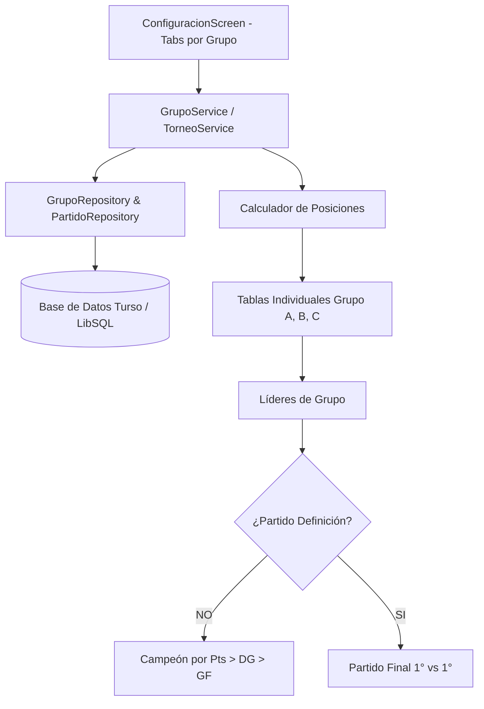

# Requirements

### Overview & Goals
Permitir la gestión de **múltiples grupos de 4 equipos** para un mismo día de campeonato en la pantalla de **Configuración & Tabla**. Manteniendo al equipo principal (Real Dunalastair) como foco del seguimiento en vivo, el sistema permitirá registrar los resultados de todos los cuadrangulares adicionales del día, generar sus tablas de posiciones individuales y determinar al **Campeón del Día** automáticamente mediante criterios oficiales de desempate o a través de un **Partido de Definición** opcional.

### Scope

#### In Scope
- **Múltiples grupos por fecha**: Creación del grupo principal y posibilidad de añadir grupos adicionales con nombres personalizados escritos por el Administrador.
- **Generación automática de fixtures**: Combinatoria de 6 partidos por cada grupo de 4 equipos.
- **Tablas de posiciones independientes**: Cada grupo calcula y visualiza su propia tabla de posiciones (PJ, PG, PE, PP, GF, GC, DG, Pts).
- **Registro simplificado de marcadores**: Para grupos secundarios, registro directo y ágil de goles local/visita sin sobrecargar la UI.
- **Determinación del Campeón del Día**:
  - **Modo Tabla General de Líderes**: Comparación automática de los primeros lugares por 1. Puntos, 2. Diferencia de Goles (`DG`), 3. Goles a Favor (`GF`).
  - **Modo Partido de Definición**: Opción configurable por día para programar y definir al campeón en un partido final entre los líderes.
- **Experiencia de Usuario en Pestañas (Alternativa 1)**: Navegación fluida por Chips/Tabs horizontales (`[ Grupo A ]`, `[ Grupo B ]`, `[ 🏆 Campeón ]`, `[ ➕ Agregar Grupo ]`).
- **Control de Roles**: Rol Administrador puede crear grupos, editar marcadores y configurar opciones; Rol Invitado visualiza marcadores, tablas y podio en tiempo real.

#### Out of Scope
- Cronómetro y registro minuto a minuto de jugadores/suplentes para los grupos secundarios (solo aplica al equipo principal).
- Grupos con cantidad distinta a 4 equipos (se mantiene el estándar de cuadrangulares).

# Technical Design

### Current Implementation
- `GrupoRepository` y `GrupoService.cargar_grupo_por_fecha()` consultan únicamente un solo grupo por fecha (`LIMIT 1`).
- `configuracion.py` renderiza una única tabla de posiciones y una sola lista de partidos para la fecha seleccionada.
- Los partidos se vinculan a un `grupo_id` y tienen banderas como `es_principal` y `jugado`.

### Key Decisions
1. **Pestañas por Grupo (Chips Horizontales)**: Permite alternar instantáneamente entre cuadrangulares sin recargar toda la página ni saturar la pantalla en dispositivos móviles.
2. **Registro Ligero para Grupos Secundarios**: Los partidos de rivales secundarios solo requieren actualización de marcador y estado jugado, manteniendo la interfaz rápida e intuitiva.
3. **Persistencia Flexible del Torneo**: Guardar la configuración del torneo del día (incluyendo la opción de partido de definición) asociada a la fecha en la base de datos.
4. **Cálculo Desacoplado de Standings**: Una función pura que recibe partidos y lista de equipos, permitiendo calcular la tabla de cualquier grupo y generar la tabla de líderes consolidada.

### Architecture Diagram

### Components & File Structure
- `backend/models/grupo.py`: Agregar propiedad `es_principal` si aplica.
- `backend/database/repositories.py`:
  - `GrupoRepository.obtener_todos_por_fecha(fecha)`
  - `GrupoRepository.crear(nombre, fecha, equipo_principal, equipos, es_principal)`
  - `PartidoRepository.crear_partido_definicion(...)`
- `backend/services/grupo_service.py`:
  - `cargar_grupos_por_fecha(fecha)`
  - `crear_grupo_adicional(nombre, fecha, equipos)`
  - `calcular_posiciones(partidos, equipos)`
  - `calcular_campeon_del_dia(grupos_con_partidos, con_partido_definicion)`
- `frontend/screens/configuracion.py`:
  - Selector de pestañas por grupo (Chips).
  - Formulario modal o colapsable de creación de nuevos grupos.
  - Vista de tabla y partidos del grupo seleccionado.
  - Bloque visual del **🏆 Campeón del Día / Gran Final**.

# Testing

### Validation Approach
Validar de forma automatizada y manual la integridad de los datos, el cálculo de las tablas y la determinación del campeón.

### Key Scenarios
1. **Creación de Cuadrangular Principal + Grupos Secundarios**:
   - Crear el grupo principal con Real Dunalastair.
   - Agregar un segundo grupo con 4 equipos rivales y nombre personalizado.
   - Verificar que se generen exactamente 6 partidos por cada grupo.
2. **Cálculo de Tablas Independientes**:
   - Ingresar marcadores en el Grupo A y Grupo B.
   - Verificar que los puntos, goles a favor, goles en contra y DG se reflejen exclusivamente en la tabla del grupo respectivo.
3. **Determinación del Campeón sin Partido Final**:
   - Registrar resultados donde dos equipos de distintos grupos queden primeros con igual o distinto puntaje.
   - Verificar el desempate por Puntos -> Diferencia de Goles -> Goles a Favor.
4. **Determinación del Campeón con Partido Final**:
   - Activar el switch de Partido de Definición.
   - Verificar que se muestre el enfrentamiento final entre los 2 mejores clasificados y que el ganador se corone Campeón del Día.
5. **Permisos y Rol Invitado**:
   - Cambiar a Rol Invitado y verificar que no se permitan ediciones de marcadores ni creación de grupos, pero sí la consulta de todas las pestañas y el podio.

# Delivery Steps

### ✓ Step 1: Preparar rama git y actualizar modelo de base de datos para múltiples grupos
- Crear y posicionarse en la rama de trabajo `feature/multiples-grupos`.
- Extender la tabla `grupos` en `backend/database/repositories.py` para soportar múltiples grupos por fecha y registrar si es el grupo principal (`es_principal`).
- Crear o actualizar la estructura para almacenar la configuración de torneo del día (ej. bandera `partido_definicion` y partido de definición final).
- Agregar en `GrupoRepository` los métodos `obtener_todos_por_fecha(fecha)` y `obtener_por_id(grupo_id)`.
- Asegurar migraciones automáticas en `DatabaseInitializer.inicializar()` sin afectar datos existentes.

### ✓ Step 2: Implementar servicios de negocio para múltiples grupos, fixtures y cálculo de campeón
- Modificar `GrupoService.cargar_grupos_por_fecha(fecha)` para retornar todos los grupos del día con sus respectivos partidos.
- Implementar `GrupoService.crear_grupo_adicional(nombre, fecha, equipos, es_invitado)` para generar automáticamente los 6 partidos (combinatoria de 4 equipos) para los grupos secundarios.
- Implementar un calculador de tablas de posiciones (`calcular_tabla_grupo(partidos, equipos)`) reutilizable por grupo.
- Implementar la lógica de determinación del **Campeón del Día**:
  - Comparación de líderes de grupo por criterios oficiales: 1° Puntos, 2° Diferencia de Goles (`DG`), 3° Goles a Favor (`GF`).
  - Soporte para partido de definición entre los primeros lugares cuando la opción esté activa.

### ✓ Step 3: Diseñar interfaz de usuario con pestañas por grupo y registro simplificado de marcadores
- Integrar la barra de pestañas / chips de navegación por grupo en `frontend/screens/configuracion.py` (`[ Grupo Principal ]`, `[ Grupo B ]`, ..., `[ ➕ Agregar Grupo ]`).
- Implementar el diálogo / formulario para que el Administrador agregue nuevos grupos con nombre personalizado y 4 equipos.
- Renderizar la tabla de posiciones específica e independiente del grupo seleccionado.
- Mostrar la lista de partidos del grupo activo: para el grupo principal se mantiene el acceso completo (mantenedor/partido en vivo) y para los grupos secundarios una vista simplificada de digitación rápida de marcadores (Goles Local vs Goles Visita).
- Añadir el interruptor / checkbox de configuración: *"Definir Campeón con Partido Final (1° vs 1°)"*.

### ✓ Step 4: Implementar tarjeta de Campeón del Día y sincronización reactiva
- Diseñar el componente / tarjeta destacada de **🏆 Campeón del Día**:
  - Vista del Podio / Tabla Comparativa de Líderes en tiempo real según Puntos > DG > GF.
  - Si está activada la opción de partido de definición, mostrar la tarjeta del partido de la gran final con los 2 mejores equipos clasificados y su marcador definitorio.
- Integrar la sincronización en vivo del estado y actualización reactiva al cambiar resultados o alternar entre grupos.
- Adaptar el reseteo del día para limpiar todos los grupos o el grupo seleccionado de la fecha.

### ✓ Step 5: Validación integral, pruebas de cálculo y verificación de compilación
- Validar la generación automática de fixtures (6 partidos por grupo secundario).
- Validar el cálculo exacto de puntos, DG y GF en tablas independientes y desempates de líderes.
- Comprobar la alternancia de roles (Administrador vs Invitado) y permisos de edición de marcadores.
- Validar la compilación e integridad de todo el proyecto con `python -m compileall`.