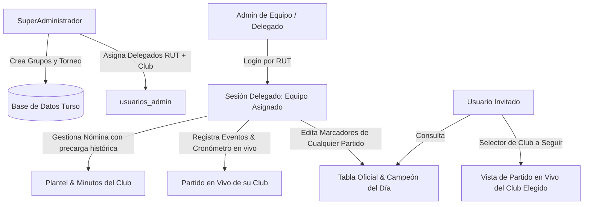

# Requirements

### Overview & Goals
Evolucionar la aplicación hacia una **plataforma multi-equipo para cuadrangulares y campeonatos**. Esta funcionalidad permitirá que cualquier equipo participante en los grupos del día pueda ser seleccionado o administrado por su respectivo delegado (DT / Administrador de equipo) para gestionar su nómina de jugadores (plantel), registrar minutos jugados y llevar el control de eventos en vivo (goles, tarjetas, cambios) durante sus partidos. Se incorporará un rol **SuperAdministrador** que creará los torneos y asignará delegados por RUT/Equipo desde la app, se asegurará la actualización colaborativa de marcadores entre administradores, se precargarán los planteles desde fechas previas y los usuarios Invitados podrán elegir a qué equipo seguir en tiempo real.

### Scope

#### In Scope
- **Rama Git de desarrollo**: Creación y activación de la rama `feature/multi-equipo-plataforma`.
- **Estructura de Roles y Accesos**:
  - **SuperAdministrador**: Crea los cuadrangulares del día, define las reglas del torneo y gestiona (crea, edita, elimina) los Administradores de Equipo (RUT + Equipo asignado) mediante un diálogo administrativo interno.
  - **Administrador de Equipo (Delegado)**: Ingresa con su RUT autenticado, visualiza y gestiona el **Plantel** de su club, registra los minutos/cronómetro y eventos en vivo de su equipo cuando éste juega, y puede registrar/actualizar marcadores globales de cualquier partido del campeonato.
  - **Invitado**: Consulta las tablas oficiales, fixtures y el Campeón del Día, contando con una barra/selector rápido (`[ 👁️ Siguiendo a: Real Dunalastair / Cobresal / ... ]`) para ver en la pantalla de Partido el cronómetro, alineación y eventos del equipo seleccionado.
- **Planteles por Equipo y Fecha con Precarga Automática**:
  - Cada equipo mantiene su nómina asociada a su club y fecha.
  - Al abrir un nuevo día o equipo sin nómina registrada para esa fecha, el sistema precarga automáticamente el plantel de la fecha anterior más reciente que tenga datos para ese club.
  - Soporte de Carga Rápida (WhatsApp y Excel/CSV) independiente para cada equipo.
- **Actualización Colaborativa de Marcadores**:
  - Cualquier administrador autenticado puede ingresar o corregir los goles de cualquier partido del día, evitando bloqueos si un delegado no está disponible en cancha.
- **Seguimiento en Vivo y Minutos por Equipo**:
  - Las pantallas de **Plantel**, **Ranking de Minutos** y **Partido** se contextualizan dinámicamente al equipo administrado (si es Administrador) o al equipo seleccionado para seguimiento (si es Invitado).

#### Out of Scope
- Gestión de pagos, arbitrajes externos o credenciales con contraseñas complejas (se mantiene autenticación ágil por RUT para uso rápido en cancha).

### User Stories
- **Como SuperAdministrador**, quiero crear cuadrangulares y asociar RUTs a cada equipo participante para delegar la gestión del plantel y seguimiento a los delegados de cada club.
- **Como Administrador de Equipo (DT / Delegado)**, quiero ingresar con mi RUT para administrar la nómina de mi club (precargada del último torneo), llevar los minutos jugados y registrar goles/cambios en vivo cuando mi equipo juega.
- **Como Administrador**, quiero poder registrar el resultado de cualquier partido del fixture para que la tabla oficial del torneo se mantenga siempre al día, aun si el delegado del otro equipo no está presente.
- **Como Invitado / Hincha**, quiero poder elegir a qué equipo del cuadrangular seguir en vivo para ver su tiempo de juego, titulares y eventos minuto a minuto.

---

# Technical Design

### Current Implementation
- La autenticación actual valida un único RUT fijo (`11165045`) para otorgar permisos de Administrador global sobre el equipo por defecto `Real Dunalastair`.
- La tabla `jugadores` almacena nombres, números y puestos sin discriminación explícita de `equipo` ni `fecha`.
- La pantalla `partido.py` y `estadisticas.py` vinculan el partido activo y minutos al equipo principal fijado en la configuración global.

### Key Decisions
1. **Modelo de Administradores (`usuarios_admin`)**:
   - Tabla en base de datos: `id`, `rut` (UNIQUE), `nombre_contacto`, `equipo_asignado`, `es_superadmin` (INTEGER 0/1).
   - RUT inicial por defecto para SuperAdmin: `11165045` (SuperAdministrador).
2. **Planteles por Equipo y Fecha (`jugadores`)**:
   - Extensión de la tabla `jugadores`: columnas `equipo` (TEXT) y `fecha` (TEXT).
   - Migración transparente: los registros existentes se asignan a `Real Dunalastair` y fecha actual o primera fecha registrada.
   - Algoritmo de precarga: si no existen jugadores para `(equipo, fecha_actual)`, consultar `SELECT * FROM jugadores WHERE equipo = ? AND fecha < ? ORDER BY fecha DESC` para precargar la nómina más reciente.
3. **Contexto de Equipo Activo en Memoria (`main.py`)**:
   - Si el usuario es **SuperAdmin**: Puede alternar entre administrar torneos globales o seleccionar cualquier equipo para gestionar su plantel/partido.
   - Si es **Admin de Equipo**: Su contexto queda vinculado a su `equipo_asignado`.
   - Si es **Invitado**: Dispone de un selector de equipo en el header o barra de navegación para definir el equipo que sigue en la pestaña de Partido.
4. **Actualización Colaborativa de Marcadores**:
   - `PartidoRepository.actualizar_marcador_rapido` y `guardar_estado_partido` permiten que cualquier usuario con rol administrativo guarde el resultado final o parcial del partido.

### Architecture Diagram

### Components & File Structure
- `backend/models/usuario.py`: Modelo `UsuarioAdmin` (`rut`, `nombre`, `equipo`, `es_superadmin`).
- `backend/database/repositories.py`:
  - `UsuarioRepository`: Métodos `autenticar_por_rut(rut)`, `obtener_todos()`, `crear_o_actualizar(rut, nombre, equipo, es_superadmin)`, `eliminar(rut)`.
  - `JugadorRepository`: Adaptar consultas para filtrar por `equipo` y `fecha`, e implementar `obtener_ultimo_plantel_historico(equipo, fecha_actual)`.
  - `DatabaseInitializer`: Migración de tablas `usuarios_admin` y columnas `equipo`, `fecha` en `jugadores`.
- `backend/services/usuario_service.py`: Lógica de validación, roles y asignación de equipos.
- `backend/services/jugador_service.py`: Adaptación de servicios de plantel, importación masiva y cálculo de minutos vinculados al equipo y fecha.
- `frontend/screens/admin_usuarios.py`: Diálogo / pantalla modal del SuperAdmin para gestionar delegados por equipo.
- `frontend/screens/configuracion.py`: Selector de grupos, actualización de marcadores colaborativa y acceso al gestor de delegados para SuperAdmin.
- `frontend/screens/plantel.py` y `carga_plantel.py`: Filtrado por equipo activo, soporte de precarga automática histórica e importación masiva.
- `frontend/screens/partido.py`: Activación dinámica del partido en función del equipo administrado o seguido.
- `frontend/screens/estadisticas.py`: Ranking de minutos filtrado por equipo y fecha.
- `main.py`: Adaptación del diálogo de login por RUT, detección de SuperAdmin / Delegado / Invitado, selector de seguimiento para invitados y sincronización en vivo.

---

# Testing

### Validation Approach
Pruebas automatizadas y de flujo de usuario con validación de persistencia, aislamiento de datos por equipo y precarga histórica.

### Key Scenarios
1. **Autenticación y Roles**:
   - SuperAdmin ingresa con su RUT (`11165045`) y tiene acceso completo a la creación de cuadrangulares y al mantenedor de delegados.
   - Crear un delegado para `Cobresal` con un RUT de prueba.
   - Ingresar con el RUT del nuevo delegado y verificar que su contexto cambie automáticamente a `Cobresal`.
2. **Gestión de Plantel y Precarga Histórica**:
   - Delegado de `Cobresal` carga su nómina en la fecha 1.
   - En la fecha 2, verificar que la pantalla de plantel de `Cobresal` precargue automáticamente los jugadores de la fecha 1.
   - Modificar jugadores en la fecha 2 y verificar que los datos de la fecha 1 permanezcan intactos.
3. **Actualización Colaborativa de Marcadores**:
   - Delegado de `Real Dunalastair` actualiza el marcador de un partido entre `Cobresal` vs `Colo-Colo`.
   - Verificar que el marcador se actualice inmediatamente en la tabla general de posiciones para todos los usuarios.
4. **Seguimiento en Vivo para Invitados**:
   - Usuario invitado selecciona seguir a `Cobresal`.
   - Verificar que en la pantalla de Partido se visualice la alineación, cronómetro y eventos del partido de `Cobresal`.
5. **Compilación e Integridad**:
   - Validar sintaxis y compilación completa del proyecto con `python -m compileall`.

---

# Execution Steps

### ✓ Step 1: Preparar rama git y actualizar modelo de base de datos para multi-equipo
- Crear y activar rama git `feature/multi-equipo-plataforma`.
- Crear modelo `UsuarioAdmin` (`backend/models/usuario.py`).
- Implementar `UsuarioRepository` en `backend/database/repositories.py` para gestión de delegados (RUT, nombre, equipo, es_superadmin).
- Extender `jugadores` con columnas `equipo` y `fecha`, e implementar migraciones automáticas en `DatabaseInitializer` y carga de superadmin por defecto (`11165045`).

### ✓ Step 2: Implementar lógica de servicios para usuarios, planteles por equipo y precarga histórica
- Implementar `backend/services/usuario_service.py` con validación de RUT, autenticación y CRUD de delegados.
- Adaptar `JugadorRepository` y `backend/services/jugador_service.py` para consultar por `equipo` y `fecha`, e implementar precarga automática del último plantel histórico.

### ✓ Step 3: Crear mantenedor de delegados y adaptar pantalla de configuración
- Crear `frontend/screens/admin_usuarios.py` para que el SuperAdmin cree, edite y elimine administradores de equipo (RUT + Equipo).
- En `frontend/screens/configuracion.py`, agregar botón de acceso a delegados (solo SuperAdmin), permitir actualización colaborativa de marcadores y mantener selector de cuadrangulares.

### ✓ Step 4: Adaptar pantallas de Plantel, Carga Rápida, Partido y Estadísticas por equipo
- Adaptar `PlantelScreen` y `CargaPlantelScreen` para gestionar la nómina del equipo activo (`equipo_activo`), soportando precarga histórica y carga rápida independiente.
- Adaptar `PartidoScreen` para sincronizar y operar cronómetro, alineación y eventos del partido del equipo administrado o seguido.
- Adaptar `EstadisticasScreen` (Ranking) para calcular minutos y exportar reporte filtrado por el equipo y fecha activa.

### ✓ Step 5: Integrar autenticación por roles, selector de seguimiento para invitados y sincronización en main.py
- Adaptar el diálogo de acceso por RUT en `main.py` para identificar si es SuperAdmin, Admin de Equipo (con su equipo asignado) o Invitado.
- Para rol Invitado, incorporar un selector/barra para elegir a qué equipo seguir en vivo en la pantalla de Partido.
- Para SuperAdmin, permitir alternar o seleccionar el equipo que desea gestionar en Plantel/Partido.
- Ajustar loop de cronómetro y sincronización en vivo.

### ✓ Step 6: Validación integral, pruebas automatizadas y compilación
- Ejecutar pruebas automáticas de autenticación, precarga histórica de nóminas, actualización de marcadores y aislamiento por club.
- Validar compilación con `python -m compileall`.

---